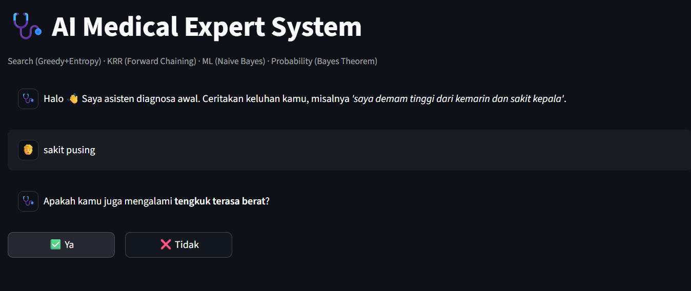
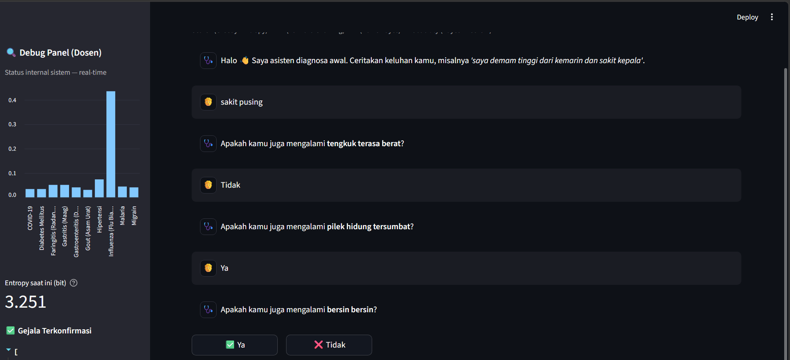
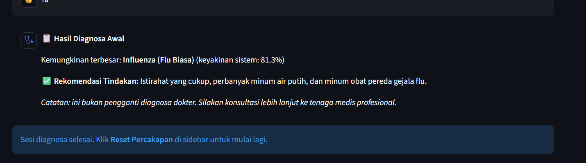

# AI Medical Expert System

An interactive medical expert system chatbot built with Python and Streamlit. The system combines Bayesian probability, rule-based reasoning, machine learning, and information-gain-based search to analyze user symptoms and provide an initial assessment.

> **Disclaimer:** This project is developed for educational purposes only. It is not a substitute for professional medical diagnosis, consultation, or treatment.

## Overview

AI Medical Expert System is a chatbot designed to demonstrate how multiple Artificial Intelligence techniques can work together in a single decision-making pipeline.

Users can describe their symptoms using natural language. The system extracts relevant symptoms, calculates disease probabilities, evaluates predefined rules, and asks additional questions when more information is required.

The application also provides a real-time reasoning panel that allows the internal decision-making process to be inspected.

## Preview

### Main Interface

The main interface provides an interactive chatbot where users can describe their symptoms and answer follow-up questions.

<p align="center">
  
</p>

### Reasoning and Debug Panel

The debug panel displays the internal state of the system, including disease probabilities, entropy, confirmed symptoms, and the reasoning trace.

<p align="center">
  
</p>

### Diagnosis Result

After collecting sufficient information, the system presents the most likely condition together with a recommended action.

<p align="center">
  
</p>

## Key Features

* Interactive Streamlit chatbot
* Natural-language symptom input
* Keyword and synonym matching
* Fuzzy symptom matching
* Negation detection
* TF-IDF feature extraction
* Multinomial Naive Bayes classification
* Bayesian probability calculation
* Forward Chaining rule evaluation
* Critical symptom detection
* Entropy calculation
* Greedy Best-First Search
* Expected Information Gain for question selection
* Real-time reasoning trace
* Disease probability visualization
* Conversation reset functionality

## AI Architecture

The system follows a multi-stage reasoning pipeline:

```text
User Input
    |
    v
Symptom Extraction
    |
    +----------------------+
    |                      |
    v                      v
Rule-Based Matching    Naive Bayes
    |                      |
    +----------+-----------+
               |
               v
      Confirmed / Rejected
           Symptoms
               |
               v
      Bayesian Probability
            Update
               |
               v
        Rule Evaluation
        (Forward Chaining)
               |
        +------+------+
        |             |
        v             v
    Emergency     Threshold
     Detected       Reached
        |             |
        v             v
    Warning       Diagnosis
                      |
                      |
               If not sufficient
                      |
                      v
             Entropy Calculation
                      |
                      v
          Expected Information Gain
                      |
                      v
          Greedy Best-First Search
                      |
                      v
              Next Question
```

## AI Methods

### 1. Rule-Based Symptom Extraction

The system first attempts to identify symptoms using predefined keywords and synonyms.

It also supports fuzzy matching to handle slightly different user input and includes basic negation detection.

For example:

```text
"I have a fever"
```

can be interpreted as a confirmed fever symptom, while:

```text
"I don't have a fever"
```

can be interpreted as a rejected symptom.

### 2. Machine Learning

The project uses TF-IDF together with Multinomial Naive Bayes to classify symptom-related input.

The classifier is implemented using a One-vs-Rest strategy and trained from the symptom keywords and synonyms defined in the system.

### 3. Bayesian Probability

Each disease has an initial prior probability. When symptoms are confirmed or rejected, the system updates the probability of each disease using the corresponding likelihood values.

The probabilities are then normalized and ranked to determine the current most likely condition.

### 4. Forward Chaining

The rule engine evaluates the current state of the system after the probability calculation.

The rules include:

* Critical symptom detection
* Diagnosis threshold evaluation
* Further inquiry when the current evidence is insufficient

If a critical symptom is detected, the system immediately produces an emergency warning.

### 5. Entropy and Information Gain

When the system cannot confidently reach a diagnosis, it searches for the most useful next question.

Entropy measures the uncertainty of the current probability distribution.

The system then calculates Expected Information Gain for candidate symptoms and selects the symptom that is expected to reduce uncertainty the most.

### 6. Greedy Best-First Search

The next question is selected using a Greedy Best-First Search strategy.

The heuristic used by the search process is:

```text
Expected Information Gain
```

The system prioritizes the question that is expected to provide the greatest reduction in uncertainty.

## Reasoning Trace

One of the main features of the application is the **Debug Panel**.

It provides visibility into the internal reasoning process, including:

### Symptom Extraction

Shows symptoms detected by:

* Rule-based keyword/fuzzy matching
* Naive Bayes classification
* Direct user responses

### Bayesian Update

Displays the top disease probabilities and the probability calculation breakdown.

### Rule Engine

Shows the Forward Chaining rules and whether their conditions were satisfied.

### Search

Displays:

* Current entropy
* Candidate symptoms
* Information Gain values
* Selected next question

This makes the system easier to understand, debug, and demonstrate in an academic setting.

## Project Structure

```text
AI-Medical-Expert-System/
│
├── app.py
├── Penyakit.json
├── requirements.txt
├── README.md
│
└── assets/
    └── screenshots/
        ├── main-interface.png
        ├── debug-panel.png
        └── diagnosis-result.png
```

| File / Directory      | Description                                                                          |
| --------------------- | ------------------------------------------------------------------------------------ |
| `app.py`              | Main Streamlit application and AI reasoning pipeline                                 |
| `Penyakit.json`       | Disease knowledge base, symptoms, probabilities, thresholds, and recommended actions |
| `requirements.txt`    | Python dependencies                                                                  |
| `README.md`           | Project documentation                                                                |
| `assets/screenshots/` | Application screenshots used in the README                                           |

## Technology Stack

| Technology               | Purpose                               |
| ------------------------ | ------------------------------------- |
| Python                   | Core programming language             |
| Streamlit                | Web application and chatbot interface |
| scikit-learn             | Machine learning components           |
| TF-IDF                   | Text feature extraction               |
| Multinomial Naive Bayes  | Symptom classification                |
| Bayesian Probability     | Disease probability estimation        |
| Forward Chaining         | Rule-based reasoning                  |
| Greedy Best-First Search | Follow-up question selection          |
| Entropy                  | Uncertainty measurement               |
| Information Gain         | Search heuristic                      |
| JSON                     | Knowledge base storage                |

## Requirements

* Python 3.9+
* pip

Main dependencies:

```text
streamlit
scikit-learn
```

## Installation

Clone the repository:

```bash
git clone <repository-url>
cd AI-Medical-Expert-System
```

Install the required dependencies:

```bash
pip install -r requirements.txt
```

## Running the Application

Start the Streamlit application:

```bash
streamlit run app.py
```

The application will normally be available at:

```text
http://localhost:8501
```

Open the address in a web browser to start the application.

## Example Interaction

A user can start by describing their symptoms:

```text
I have a headache.
```

The system may then ask a follow-up question:

```text
Are you also experiencing a heavy feeling in the back of your neck?
```

The user can answer directly or use the provided buttons.

The process continues until the system has enough information to produce an initial assessment or determine that further information is required.

## Knowledge Base

Disease and symptom information is stored in `Penyakit.json`.

The knowledge base contains information such as:

* Disease names
* Prior probabilities
* Symptoms
* Symptom likelihood values
* Critical symptoms
* Diagnosis thresholds
* Recommended actions

This separation allows the knowledge base to be modified without changing the main reasoning pipeline.

## Limitations

This project has several limitations:

* The knowledge base only covers the diseases and symptoms defined in `Penyakit.json`.
* Probability values depend on the parameters defined in the knowledge base.
* Natural-language understanding is limited to the implemented matching and classification methods.
* The system does not perform physical examinations.
* The system does not use laboratory results or medical imaging.
* The output represents an initial system assessment, not a clinical diagnosis.

## Educational Purpose

This project demonstrates the integration of several Artificial Intelligence concepts into one application:

* Machine Learning
* Probabilistic Reasoning
* Knowledge Representation and Reasoning
* Search Algorithms
* Natural-Language Symptom Processing
* Decision Making under Uncertainty

The project is intended to show how different AI techniques can complement each other rather than relying on a single algorithm.

## Disclaimer

This application is an educational software project and is not intended to provide professional medical diagnosis or treatment.

The results should not be used as a substitute for consultation with a qualified healthcare professional. If serious or emergency symptoms occur, seek appropriate medical attention immediately.

## Author

Developed as an Artificial Intelligence project for educational purposes.
